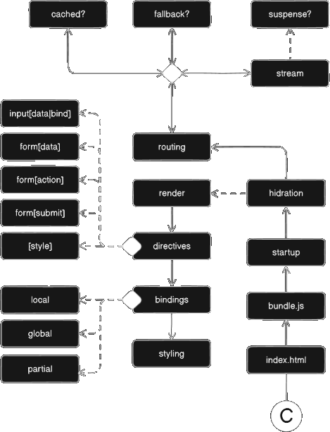
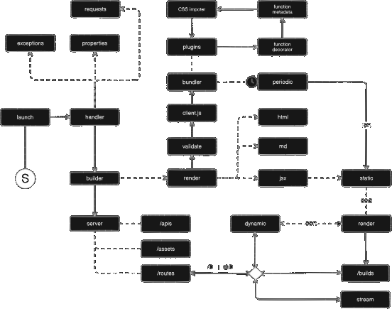

 

# Domain

Overview domain workflows

 
<aside cols='4:5'>

It is very coloquial domain view of each client-side and server-side module with its basic workflow. The notation used here means:

* `-->` implementation details
* `──>` dependency workflow
* `<->` bidirectiona
* `(C)` client-side starter
* `(S)` server-side starter
* `< >` conditional node
* `[ ]` process concept

</aside>

