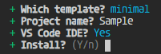

<style>@import url(creation.css);</style> 

# Installation

> HTML | CSS | TypeScript | Bun

New project with the template creator using `react-away/create@latest`. 

```ps
$ bunx react-away/create 
```


<aside id='cli' cols='3:5'>



* **template**: empty | minimal | sampling
* **project name**: it will create the folder project
* **vs code**: if yes, it will create debug settings

</aside>

The minimal templates starts with index.html wrapper and index.ts boostrap.

<aside cols='2'>

```typescript
// index.ts
import ReactAway 
from 'react-away'

await ReactAway.launch().server()  
```

```ts
// routes/index.ts
export default props => <>
   <h1>Welcome to React Away</h1>
   <p>Hello World!</p>
</>
```

</aside>

React Away is debug-ready configuration for Vs Code and with package.json scripts:

<section style='margin-left: 30px; zoom: 95%'>

| `bun run start` | `bun run debug` |  `bun run build`  | `bun run clear`    |
| --------------: | :-------------: | :---------------: | :----------------- |
|   build and run | vscode debugger | build the project | clear build folder |

</section>