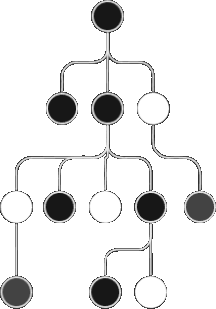

<style>@import url(storing.css);</style> 

# Storing

> reactive object • self-rendering state • dependency injection • SWR fetching • ORM synchornizer

## Reactive objects 

Reactive object is a self-rendering state that encapsulates the state handling boilerplate code. When a reactive objct is changed, it call the render of its hosted component. 

| | | |
|-:|-|-|
| local | props | all props is meade reactive | 
| global | store + DI | object injected component root |
| partial | stores + decorator  | shared states between components |

### Local state props 

Props and states are merged in reactive object for imediate local state handling.

```tsx
const Hello = props => <>
    Hello { props.name } !
   <input value={props.name} onChange={e => props.name = e.target.value} />
</>
```

### Injectable Global state

Store is an injectable global state, following the Single Source of Truth (SSoT) pattern.

```tsx
await launch({ store:{ name: 'world' }}).server()  // store injection in launch

const Hello = (props: Props, feeds: Feeds) => <>   <!-- DI resolution in feeds -->
   Hello { feeds.store.name || 'World' } !
   <input value={feeds.store.name} onChange={e => props.name = e.target.value} />
</>
```

### Modular Partial states

Partial states are modular state alterantive to deal with large monolith component tree.

<aside id='partial-state' diagram cols='1:auto'>

```ts
const person = useStore({ guid: 0, name: 'john' })

@client(true, person)
const Hello = props => <> 
   Hello { person.name } !
   <input value={person.name} 
       onChange={e => person.name = e.target.value} />
</>

@client(true, person) 
const Hi = props => <>  Hi { person.name } !</>
```



</aside>

<style>
   ul li { 
      font-weight:700; 
      margin-top: 20px;
      margin-left: 15px; 
      margin-bottom: -20px;
      text-transform:uppercase 
   }

   img:last-of-type { 
      width: 190px;
      padding: 20px; 
      height: 250px;
      margin-bottom: -20px;
      background: var(--darkest);
   }
</style>

## Remote states

Remote states could be handled by client to server (fetching) and server to client (eventing). React Away uses [**asynchronouts-api**](https://github.com/c0d3x-software/syncher-api) library to deal with remote states.

|          |                                   | 
| -------- | --------------------------------- | 
| fetching | client to server request-response | 
| eventing | server to client request-response | 
| asyncing | dual asynchronous synchornization | 


### FETCH+ API

Fetch SWR polyfills with cache keys and timeout with revalidation in fetch.clear

<aside cols='2'>

```ts
fetch(url, { cache: "7min30s" })
fetch(url, { cacheKeys: ['todos'] })   
```

```ts
fetch.clear(cacheKeys)
fetch.clear() // invalidate all
```

</aside>


Adds  `retry` and `reget` settings, `fetch.on` interceptions and `fetch.token` state. 

<aside cols='5:4'> 


```ts
const retry = { repeat:3, interval:1000 }
const reget = { interval:1000, callback }

await fetch(url, { retry })
await fetch(url, { reget })
```

```ts
fetch.token = `Bearer ${token}`

fetch.on("request", req => ...)
fetch.on("response", res => ...)
fetch.on("exception", err => ...)
```

</aside>

### EVENT API 

Event API is a fluent facade (similar to fetch) for web standard **EventSource*### class .

```js
const es = event(url, { withCredentials: true })
   .then(() => console.log('Open connection...'))
   .then('message', e => console.log('Message', e.text))
   .then('status', e => console.log('Message', e.json.progress + '%'))
   .catch(ex => console.error(ex))
   .finnaly(() => console.log('close'))

es.close() 
```

### SYNCING API

Syncher API maps RESTful APIs for high abstract remote state handling (similar to an ORM).

<aside cols='5:4'> 

```ts 
const userApi = syncher<User>(true)
   .fetch("http://api.com/users")
   .catch(e => "not found...")
   .match(x => x, "id")  
   
await userApi.async(true)  // get 
await userApi.async() // post, put, delete
```

```ts 
interface ISync<T,E> {   
   value: T       // state
   await: boolean // pending
   heads: Headers // headers
   error: E|nyll  // exception
   async(query?)  // syncing 
}
```

</aside>