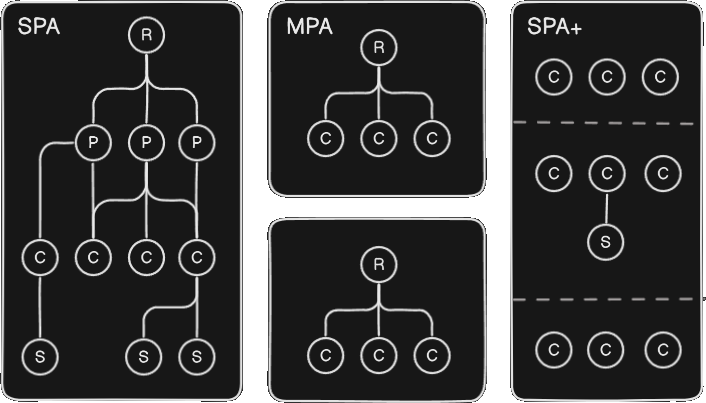

<style> @import url(css/index.css); </style>

# Frontend Research
### multiple frontend solutions

---

## Schedule

- **router-api**: unified router dom facade api
- **multi-spa**: liteweight micro-frontend library
- **restful-sync**: advanced fetching abstraction
- **html-container**: new micro-component architecture
- **jsx-pro**: improved JSX componentization

---

## Design principles

**DRY**: don't repeat yourself (reusability)
**KISS**: keep it simple, stupid! (simple design)
**YAGNI** You Ain't Gonna Need It (fitness engineering)

---

# Router API
### router facade object

---

## Problem
### duplicity | complexity

<aside cols='*:1'>
<div left>


**Drawbacks**

- counter-intuitive
- poorly designed
- multiple apis
- SRP faulty

</div>

```ts
// current route
const route = location.pathname 

// url search params API
const search = new UrlSearchParams(location.search) 

// convert params into object 
Object.fromEntries(search.entries()) 

// client-side (ajax) route navigation
history.pushState({}, null, '/new/route') 
```

</aside>

---

## Solution
### router facade specification

<aside cols='*:1'>
<div left>

**Advantages**

- unified API
- dynamic route parser
- nano-library (size < 1kb)

</div>

```ts
export interface IRouter {   
   now: string             // window.location.pathname 
   goto(steps: number)     // undo or redo history steps
   goto(route: string)     // window.history.pusthState(...) 
   query: string           // URLSearchParams -> object
   params(pattern: string) // extract dynamic route params
   history: string[]       // history of routes
}
```
</aside>

---

# RESTful sync
### fetching improvements

---

## fetch+ API
### cache | clear | token

```ts
fetch(url, { cache, ['todos'] })   // cache keys
fetch(url, { cache: "1min" })      // cache string timeout 
fetch(url, { cache: 60000 })       // cache tm
```

```ts
fetch.clear('todos', 'ok')    // remove cached keys
fetch.clear()                 // remove all caches
```

```ts
fetch.token  // last header.Authorization
```

---

## event API
### fluent EventSource facade

```ts
const es = event(url, { withCredentials: true })
   .then(() => console.log('Open connection...'))
   .then('message', e => console.log(e.text))
   .then('status', e => console.log(e.json.progress))
   .catch(ex => console.error(ex))
   .finnaly(() => console.log('closed'))

es.close() 
```

---

## sync api
## object RESTful map

```ts
const userApi = syncher<User>(true)
   .fetch("http://api.com/users")
   .catch(e => "not found...")
   .match(x => x, "id")   
```

```ts
await userApi.async()      // reading sync (replace)
await userApi.async(true)  // writing sync (diff)
```

---

# Microfrontend
### orchestration | coordination | isolation

---

## Architecture

<aside cols='*:1'><div>

**CHARACTERISTICS**

- micro-services advantages in frontends
- break monoliths into micro-frontends
- small, independent and interoperative
- by page route or page slice

</div><div>

**RESPONSABILITIES**

- orchestration of loading apps
- coordination between routes
- isolation of js, css, etc

</div>
</side>

---

## Alternatives
### common microfrontend solutions

|           |                   |                                                            |
| --------: | ----------------- | :--------------------------------------------------------- |
|    iframe | web standard      | shared context problem, CSS disalignament, low performance |
| micro-spa | framework         | coupled over-abstraction, complex over-configuration       |
|  webpack5 | module federation | addapting its runtime share component feature              |

---

## Solutions

### low abstraction | HTML+ approach

```html
<slot src='http://app.vue.com'>loading...</slot>
<slot route='/' src='http://app.react.com'>loading...</slot>   
<slot route='/user/:id' src='http://app.angular.com'>loading...</slot>
```

full routing | html merging | metatags transfers | size < 1kb

---

# Micro components
### from monolith to lite components
---

## Monolith
### complexity | performance

<aside cols='2'>

<div left>

**(R)**: root component
**(P)**: page component
**(C)**: component
**(S)**: sub-component

<hr/>

- costful rendering
- highly complex
- deep tree

</div>
</aside>

---

## Architecture
### spa | mpa | spa+

<aside cols='*:1'>
<div>

**legend**
- [ ] page
- ( ) component
- -- page container

<br/>

**SPA+**
- server-side first
- html container
- same context
- stateful

</div><div>
   

   **[ ]** page  &nbsp;&nbsp;  **( )** component  &nbsp;&nbsp; **[-]** page container

</div>
</aside>

---

## Solution
### container | federation

<aside cols='*:1'>

- component
- props binds
- data binding
- state handling
- reactive objects
- micro-components
- metatag transfers
- router facade

```html
<container src='http://etc.com/components.ts'>
   <h1>${ self.title }</h1>

   <Hello number=1 string='' object={}
      boolean=true array=[] refer=self.obj />

   <input oninput='self.title=event.target.value' />
</container>
```

</aside>

---

# JSX framework
### fixed JSX componentization

---

## Context
### JSX componentization

<aside cols='*:1'>

- main componentization technology
- react.js is its main library  (creator)
- also another jsx libs, like preact.js
- template -> script inversion
- easy, lite and flex design
- stateful component

```tsx
const Component = props => <>
   <h1>Hello World!</h1>
   <h2>Welcome to JSX</h2>
</>
```

<aside>

---

## Problem
### all 3 major problems

|                |                                                        |     |
| -------------: | :----------------------------------------------------- | --- |
|  scopeless CSS | importing CSS leaks to global scope, making it useless |
| verbose states | highly complexy and verbose stateful component design  |
| opaque routing | component as function, function has no metadata syntax |

---

## Problem 1

<div style='margin-top:-20px; margin-bottom:100px;'>

```tsx
import './hello.css' // it exists, but it does not work properly 
```

<div style='position:relative; margin-top: -145px;'><b>CSS</b> import bug</div>


</div>
<aside cols='1:1:1'>
<div>

**css-module**

```tsx
import css from './hello.module.css'

export const Hello = () => <>
   <h1 className={css.hello}>
      Hello World!
   </h1>
</>
```

<hr/>

```css
.hello {
  color: whitesmoke;
  font-weight: bold;
  background: dimgrey;
  border-radius: 0.5rem;
}
```

</div><div>

**styled-component**

```tsx
const Title = styled.h1`
  color: whitesmoke;
  font-weight: bold;
  background: dimgrey;
  border-radius: 0.5rem;
`;

export const Hello = () => <>
   <Title>Hello World!</Title>
</>
```

</div><div>

**tailwind**

```tsx
export const Hello = () => (
  <h1 className="font-bold
      text-[whitesmoke] mt-4
      bg-[dimgrey] rounded-lg 
      shadow-md px-4 py-2">
    Hello World!
  </h1>
);

```

</div>
</aside>

---

## Solution 1
### fixed **CSS** imports

```tsx
import "./hello.css" // module-scoped

@style('./hello.cs') // component-scoped
const Hello = () => <h1>Hello World!</h1>
```

fixed imports | CSS decorator | classless CSS


</aside>

---

## Problem 2
### **state** complexity

<aside cols='4:5'>
<div>

```tsx
const Hello = () => <h1>Stateless</h1>
```

<br/>


```tsx
import React, { useState } from 'react'

function LocalStateHello() {
  const [name, setName] = useState('')
  
  return <h1>
      <h1>Hello, {name || 'World'}!</h1>
      <input value={name} onChange={e => 
         setName(e.target.value)} />
   </h1>
}
```

</div>

```tsx
import React, { useState } from 'react'
import React, { createContext, useContext } from 'react'

const Ctx = createContext()

export default function App() {
  const [name, setName] = useState('')
  return <Ctx.Provider value={{ name, setName }}>
      <Hello />
    </Ctx.Provider>
}

function SharedStateHello() {
  const { name, setName } = useContext(Ctx)
  return <div>
      <h1>Hello, {name || 'World'}!</h1>
      <input value={name} onChange={e => 
         setName(e.target.value)} />
   </div>
}
```

</aside>

---

## Solution 2
### sel-rendering **state**

<aside cols='2'>

```tsx
const Hello = props => <>
   <h1>Hello, {props.name || 'World'}!</h1>
   <input data={state} bind='name' />
</>
```

```tsx
import { useStore } from 'react-away'
const store = useStore({ name: string })

@client(true, store)
const Hello = props => <>
   <h1>Hello, {store.name || 'World'}!</h1>
   <input data={store} bind='name' />
</>
```

</aside>
<br/>

page containers | function decorators | binding props

---

## Problem 3
### **route** verbosity

<aside cols='2' style='margin-top:-20px'>
<div>

**react-router** over-design

```ts
import React from 'react'
import { Home, About } from './routes'
import { Routes, Route } from 'react-router-dom'
import { BrowserRouter, Link } from 'react-router-dom'

export default () => <>
   <BrowserRouter>
      <nav>
         <Link to="/">Home</Link> |
         <Link to="/about">Sobre</Link>
      </nav>

      <Routes>
         <Route path="/" element={<Home />} />
         <Route path="/about" element={<About />} />
      </Routes>
   </BrowserRouter>
</>
```

</div><div>

**next.js** over-conventions

<p style='background:transparent; color:whitesmoke; font-size:0.85em; font-family: geist'>
template.js template.jsx route.js
default.js default.jsx middleware.js
next.config.js pages/api/ bsp;pages/_app.js
pages/_app.jsx pages/_document.js
pages/_document.jsx pages/404.js
pages/500.js route.jsx app/ bsp;pages/
[...folderName] bsp;_folderName @folderName
[folderName] bsp;[[...folderName]] bsp;page.js
page.jsx layout.js layout.jsx
error.js error.jsx not-found.js
not-found.jsx loading.js loading.jsx
</p>

</div>
</aside>

---

## Solution 3
### **route** double mode

<aside cols='2:3'><div>

**static routes** by directory

|        |        |                         |
| -----: | :----- | :---------------------- |
|  index | /      | /routes/index.jsx       |
|  named | /about | /routes/about.jsx       |
|  inner | /admin | /routes/admin/index.jsx |
| nested | ./user | /routes/sub/user.jsx    |

</div><div>

**dynamic routes** by decorator

```tsx
@route('/profile/:id')
@server('periodic', '3h')
const Profile = (props, feeds) => <>
   <h1> { feeds.param.id } </h1>
</>
```
</div>
</asode>

---

# Conclusion
### projects | solutions | innovations
---

## Projects

| | |
|-:|:-|
| router-api | facade api for routing unifying location + history + URLSearchParams |
| multi-spa | low coupling web-standard approach for easy micro-frontend shell |
| html-container | new micro-component architecture for low code and fast rendering |
| restful-sync | extended fetch api, with event api facade and RESTful mapping |
| jsx-pro | fix the 3 main flaws in jsx components |

---

## Solutions

| | |
|-:|:-|
| non-cohesive routing dom api | unified routing facade with router api |
| coupled or limited microfrontend shell | lite, declarative and web standard slot extension |
| heavyweight monolith component | html containers that enable micro-components |
| non-SWR outdated fetching api | extended fetch api with sync mapping |
| jsx componentization flaws | fixed the 3 main jsx developement |


---

## Innovations

| | |
|-:|:-|
| patterns | restful map, reactive objects, props handlers, function decorators |
| architectures | micro-component architectural style, page container architectural pattern |
| specifications | route api, fetch+ api, event api, CSS loader |

---

# Thanks!
### questions?

<style>   
   [left] { text-align:left; }
   [right] { text-align:right; }
   [cols='*:1'] { grid-template-columns: auto 1fr; }
   [cols='3'] { grid-template-columns: 1fr 1fr 1fr; } 
   [cols='3:1'] { grid-template-columns: 3fr 1fr; } 
   [cols='2:3'] { grid-template-columns: 2fr 3fr; } 
   [cols='2:5'] { grid-template-columns: 2fr 5fr; } 
   [cols='1:4'] { grid-template-columns: 1fr 4fr; } 
   [cols='1:5'] { grid-template-columns: 1fr 5fr; } 
   [cols='4:5'] { grid-template-columns: 4fr 5fr; } 
   [cols='1:*:*'] { grid-template-columns: 1fr auto auto; }
   [cols='*:*:*'] { grid-template-columns: auto auto auto; }
   [cols='*:1:1'] { grid-template-columns: auto 1fr 1fr; }
   [cols='1:1:*'] { grid-template-columns: 1fr 1fr auto; }
   [cols='1:1:1'] { grid-template-columns: 1fr 1fr 1fr; }   
   [cols] pre {  margin:-10px !important; }

   pre {
      font-size: 0.9em !important;
      filter: contrast(1.2) brightness(1.2) !important;
   }

   pre > * { 
      padding: 30px !important;
      border-radius: 15px !important;
      letter-spacing: 0 !important;
      font-family: 'agave' !important;    
      background-color: #222 !important;  
   }

</style>